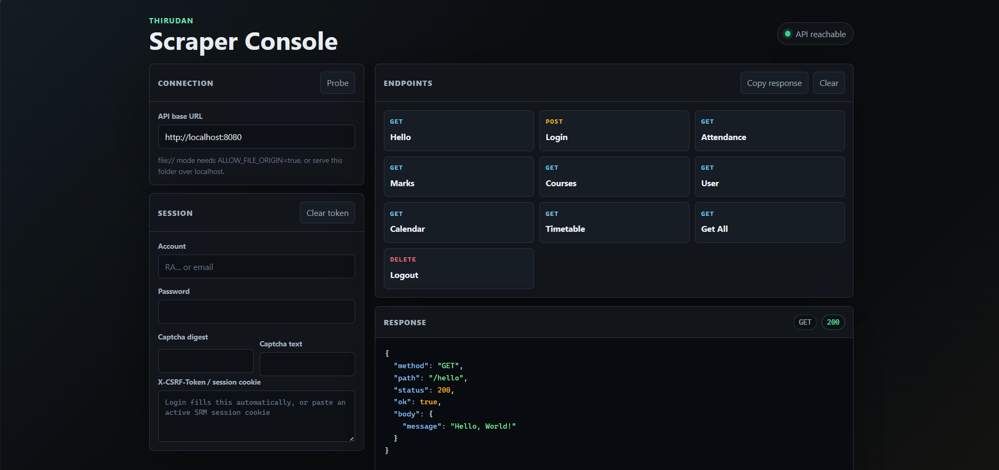
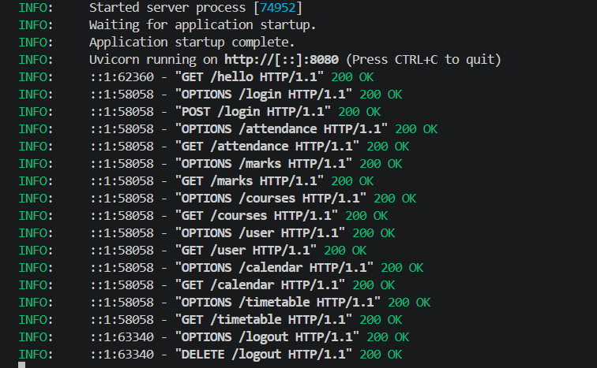

# Thirudan

>[!WARNING]
>This is an unofficial scraper for the SRM Institute of Science and Technology Academia portal. It is intended exclusively for educational and personal use. The developers are not affiliated with SRM Institute of Science and Technology and assume no responsibility or liability for any misuse of this software or for any actions taken by its users.

Thirudan is intentionally small and modular. `main.py` is the entrypoint, while the rest of the codebase is split into focused packages for HTTP routes, scraping, shared core logic, and service orchestration.

Python 3.11+ service for fetching, normalizing, and exposing SRM Academia data for local use.

## Status

Thirudan is an unofficial project and is not affiliated with SRM Institute of Science and Technology or Zoho.

Use it only with your own account, respect the portal's terms, and do not deploy it as a shared credential-collection service.

## Quick Start

```powershell
python -m venv venv
.\venv\Scripts\pip install -r requirements.txt
Copy-Item .env.example .env
.\venv\Scripts\python main.py
```

The server listens on `PORT` or defaults to `8080`.


## What You Get

- `GET /hello` for a quick health check.
- `POST /login` for SRM Academia authentication.
- `DELETE /logout` to end the active session.
- `GET /attendance`, `GET /marks`, `GET /courses`, `GET /user`, `GET /calendar`, `GET /timetable`, and `GET /get` for normalized data.
- Optional persistence hooks for cached snapshot workflows.

## Project Layout

| Path | Purpose |
| --- | --- |
| `main.py` | Application entrypoint. |
| `web/` | FastAPI routes, CORS, compression, caching, and rate-limit wiring. |
| `services/` | Login/logout, auth validation, and snapshot persistence helpers. |
| `scraper/` | HTTP transport, HTML parsing, timetable derivation, and workflow orchestration. |
| `core/` | Configuration, constants, markup helpers, rate limiting, cookies, utilities, and shared domain logic. |
| `core/schemas/` | Response models for academics, calendar, session, and timetable data. |

## API Overview

| Method | Route | Description |
| --- | --- | --- |
| `GET` | `/hello` | Confirms the API is reachable. |
| `POST` | `/login` | Authenticates against SRM Academia and returns a reusable session cookie string. |
| `DELETE` | `/logout` | Clears the active SRM session. |
| `GET` | `/attendance` | Returns normalized attendance data. |
| `GET` | `/marks` | Returns normalized marks data. |
| `GET` | `/courses` | Returns parsed course data. |
| `GET` | `/user` | Returns user profile data. |
| `GET` | `/calendar` | Returns academic calendar data. |
| `GET` | `/timetable` | Returns derived timetable data. |
| `GET` | `/get` | Returns the aggregate user, attendance, marks, courses, and timetable payload. |

All routes except `/hello` and `/login` require `X-CSRF-Token`, which is the SRM Academia cookie string returned by login.

## Scraper Check HTML

`scraper_check.html` is a browser-only tester for calling the local API without writing curl commands.

### Fields

- `API base URL`: Base address of the running Thirudan API. Use `http://localhost:8080` unless you changed `PORT`.
- `Account`: Your SRM Academia account identifier. You can enter the short account name, such as `aa1111`, or a full email address. The backend adds the SRM domain when needed.
- `Password`: SRM Academia password for the account.
- `Captcha digest`: Filled manually only when login returns a captcha challenge. The login response includes `captcha.cdigest`.
- `Captcha text`: The captcha solution you read from the captcha image URL returned by login.
- `X-CSRF-Token / session cookie`: The active SRM session cookie string. A successful login fills this automatically. You can also paste an existing cookie string here and call scraper endpoints directly.
- `Response`: Raw status and JSON body from the last request. A route can return HTTP `200` with an error-shaped body if SRM returned an unexpected page or the session is stale, so inspect this area after every request.

### Buttons

- `Hello`: Checks whether the API is reachable.
- `Login`: Sends account, password, and optional captcha fields to `/login`. On success, stores the session cookie in the `X-CSRF-Token / session cookie` field and browser session storage.
- `Attendance`: Calls `/attendance` with the current session cookie.
- `Marks`: Calls `/marks` with the current session cookie.
- `Courses`: Calls `/courses` with the current session cookie.
- `User`: Calls `/user` with the current session cookie.
- `Calendar`: Calls `/calendar` with the current session cookie.
- `Timetable`: Calls `/timetable` with the current session cookie.
- `Get All`: Calls `/get`, which fetches the aggregate user, attendance, marks, courses, and timetable payload.
- `Logout`: Calls `/logout` with the current session cookie.
- `Clear`: Clears only the response panel.

### Typical Flow

1. Start the API with `python .\main.py`.
2. Open `scraper_check.html`.
3. Click `Hello`; expect `200` and `{"message": "Hello, World!"}`.
4. Enter `Account` and `Password`, then click `Login`.
5. If the response includes `captcha`, open `captcha.image`, enter `captcha.cdigest` and the solved `Captcha text`, then click `Login` again.
6. After login succeeds, call `Attendance`, `Marks`, `Courses`, `User`, `Calendar`, `Timetable`, or `Get All`.

## Configuration

Configuration lives in `.env`. Start from `.env.example`; do not commit a populated `.env`.

### Runtime

| Variable | Purpose |
| --- | --- |
| `PORT` | API port. Defaults to `8080`. |
| `URL` | Optional comma-separated CORS origins. |
| `ALLOW_FILE_ORIGIN` | Allows `file://` tester pages by accepting browser origin `null`. Keep `false` unless testing locally. |
| `REQUEST_TIMEOUT` | Outbound SRM/Supabase request timeout in seconds. |
| `CACHE_TTL_SECONDS` | In-memory route cache lifetime in seconds. |
| `CACHE_MAX_ENTRIES` | Maximum number of in-memory cached route responses. |
| `MAX_REQUEST_BODY_BYTES` | Maximum accepted request body size. |

### SRM Academia

| Variable | Purpose |
| --- | --- |
| `ACADEMIA_BASE_URL` | SRM Academia host. |
| `ACADEMIA_PORTAL_ID` | Portal identifier used by login, logout, captcha, and session cleanup. |
| `ACADEMIA_SERVICE_NAME` | Service name sent during login. |
| `ATTENDANCE_PAGE_NAME` | Academia page name for attendance and marks. |
| `COURSE_PAGE_NAME` | Academia page name for courses, user profile, and timetable derivation. |
| `CALENDAR_PAGE_NAME` | Academia page name for academic planner data. |

### Persistence

| Variable | Purpose |
| --- | --- |
| `SUPABASE_URL`, `SUPABASE_KEY`, `ENCRYPTION_KEY` | Optional for local scraping, required for persistent snapshot cache behavior. |
| `SCRAPE_TABLE` | Supabase table for aggregate scrape cache data. |
| `CALENDAR_TABLE` | Supabase table for calendar cache data. |
| `STUDENT_KEY_COLUMN` | Column used as the student identifier in the aggregate cache table. |
| `SESSION_KEY_COLUMN` | Column used for the hashed session key in the aggregate cache table. |
| `REFRESHED_AT_COLUMN` | Column used for the last refresh timestamp in the aggregate cache table. |
| `SCHEDULE_NOTE_COLUMN` | Optional column for a schedule or operating-hours note surfaced as `scheduleNote`. |

## Scraper Flow

Login posts credentials to SRM Academia and returns a reusable cookie header after the session is established. Captcha responses include the digest and captcha image URL so the caller can retry with a solved challenge.

Attendance and marks share the same Academia page. The service decodes the embedded escaped HTML payload, extracts the attendance table, then derives marks from the nested marks section while preserving course ordering.

Courses and user profile data share the timetable page. Timetable output is derived from parsed courses, the user's batch value, and the configured slot matrices.

Calendar uses the academic planner endpoint, supports both raw table HTML and encoded payloads, sorts months and days, and computes `today`, `tomorrow`, and the current month index.

## Validation

Local checks used during the latest refactor:

```powershell
.\venv\Scripts\python.exe -m compileall .
.\venv\Scripts\python.exe -c "from web.api import app; print(app.title)"
.\venv\Scripts\python.exe -c "from web.api import app; from fastapi.testclient import TestClient; c=TestClient(app); print(c.get('/hello').json())"
```

## Screenshots

The following previews shows the activity handlers in the project: the API log and the browser-based tester.






## License

MIT. See [LICENSE](LICENSE).
